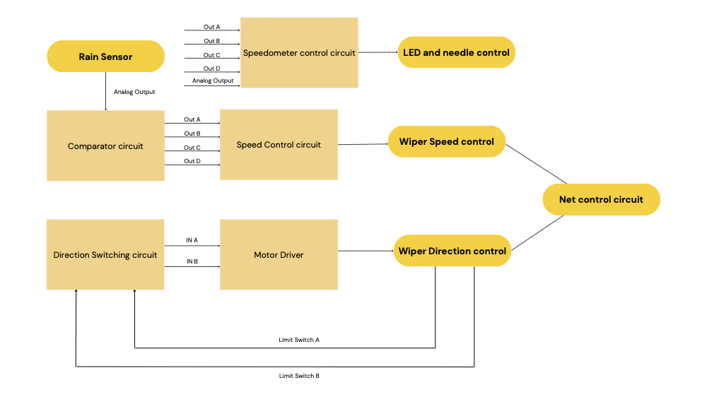

# Automated Wiper Control System with Wireless Interface

## Project Overview
This project implements an automated wiper control system with rain sensing and wireless control capabilities. The system includes:
- Rain sensor for automatic wiper speed adjustment
- Servo-controlled speedometer needle to display wiper speed levels
- Wireless control via ESP8266 hotspot
- Directional motor control for wiper movement
- Limit switches for wiper position detection

## Hardware Components
- **Rain Sensor**: Detects precipitation levels and provides analog voltage output
- **Servo Motor**: Controls the speedometer needle position
- **DC Motor**: Drives the wiper mechanism
- **ESP8266**: Provides wireless control interface
- **L298N Motor Driver**: Controls wiper motor direction and speed
- **Limit Switches**: Detect wiper end positions
- **Comparator Circuit**: Processes rain sensor signals
- **Speed Control Circuit**: Generates PWM for motor speed

## Software Components
1. **`wireless_break.ino`** - ESP8266 Web Server:
   - Creates WiFi hotspot (SSID: `ESP8266_Hotspot`, Password: `12345678`)
   - Web interface with ON/OFF buttons for system control
   - Controls GPIO pin connected to Arduino

2. **`speedometer_needle.ino`** - Arduino Servo Control:
   - Reads rain sensor analog input (A0)
   - Controls servo position based on rain intensity (4 levels)
   - Responds to ESP8266 control signals
   - Provides debug output via Serial Monitor

## System Block Diagram
Key components and their connections:

## Installation and Setup
1. Upload `wireless_break.ino` to ESP8266
2. Upload `speedometer_needle.ino` to Arduino
3. Connect hardware components as shown in schematic
4. Power on the system:
   - ESP8266 will create WiFi hotspot
   - Arduino will initialize servo and sensor inputs

## Operation
1. **Automatic Mode**:
   - Wiper speed automatically adjusts based on rain intensity
   - Speedometer needle shows current speed level (0-180°)

2. **Manual Control**:
   - Connect to ESP8266 hotspot (192.168.4.1)
   - Use web interface to turn system ON/OFF

## Schematic Details
The system uses:
- LM393 comparators for rain sensor processing
- 74HC04 and 74HC08 logic gates for signal conditioning
- L298N for motor driving
- Relay module for direction control

## Troubleshooting
- If WiFi doesn't connect, verify ESP8266 power and settings
- Check Serial Monitor for rain sensor and servo debug info
- Verify all component connections match schematic

## Future Enhancements
- Add mobile app control
- Implement speed presets
- Add weather forecast integration
- Improve power efficiency

## License
This project is open-source under MIT License.
